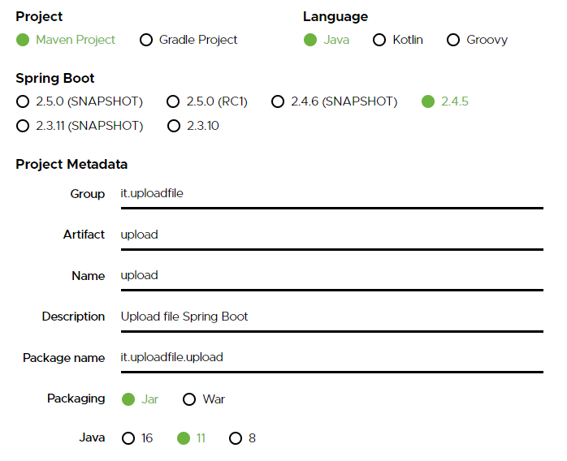

ENG | [ITA](README.md)
# Uploading and reading an Excel File

**Example projects about how to upload an Excel file and read it, displaying the data within**

* Spring Boot
* Maven
* Apache POI
* JQuery

Going on [Spring Inizializr](https://start.spring.io/) we can setup the project in this way:




Once the download is finished we have to extract it and open it with any IDE like IntelliJ IDEA.

To integrate Apache POI we need to add its dependencies in the *pom.xml* file, like this:
```xml
<dependency>
  <groupId>org.apache.poi</groupId>
  <artifactId>poi</artifactId>
  <version>4.1.2</version>
</dependency>
<dependency>
  <groupId>org.apache.poi</groupId>
  <artifactId>poi-ooxml</artifactId>
  <version>4.1.2</version>
</dependency>
```
In the path ***/resources/templates*** let's create an HTML page (like *upload.html*) containing the upload file button and the field that will show us the uploaded data:
```html
<!DOCTYPE html>
<html lang="en">
<head>
  <meta charset="UTF-8">
  <title>Upload</title>
</head>
<body>
<script src="https://ajax.googleapis.com/ajax/libs/jquery/3.6.0/jquery.min.js"></script>

<div class="custom-file">
  <form id="upload-form" enctype="multipart/form-data">
    <input class="custom-file-input" id="file" name="file" type="file"
      accept="application/vnd.ms-excel,
      application/vnd.openxmlformats-officedocument.spreadsheetml.sheet"
    onchange="onUpload();">
  </form>
</div>

<span id="showData"></span>

</body>
</html>
```
Let's handle the upload part with a Javascript code:
```javascript
function onUpload() {
	
  event.preventDefault();
  "use strict";

  var fileInput = document.getElementById('file');
  var file = fileInput.files[0];
  var formData = new FormData();
  formData.append('file',file);
        
  $.ajax({
    type: "post",
    url: '/onUpload',
    enctype: 'multipart/form-data',
    contentType: false,
    data: formData,
    processData: false,
    cache: false,
    timeout: 600000,
    success: function(data) {
      document.getElementById("showData").innerHTML = data; 
    },
    error: function() {
      console.log("error");
    }
  });
}
```
In this way we will have a simple page containing a button and the ability to upload a file. Let's now create a Java class containing a controller that will handle the uploaded file:

```java
@Controller
public class UploadController {

  @GetMapping("/")
  public String redirect(){
    return "redirect:/upload";
  }

  @GetMapping("/upload")
    public String upload(){
  return "upload";
  }

  @RequestMapping(value = "/onUpload", method = RequestMethod.POST)
  @ResponseBody
  public String singleFileUpload(@RequestParam(value = "file") MultipartFile file) {

    StringBuilder sb = new StringBuilder();
    
    try {
      InputStream fileInputStream = new BufferedInputStream(file.getInputStream());
      DataFormatter dataFormatter = new DataFormatter();
      XSSFWorkbook workbook = new XSSFWorkbook(fileInputStream);
      int numberOfSheets = workbook.getNumberOfSheets();
      for (int n = 0; n < numberOfSheets;n++){    //for every sheet sheet
          XSSFSheet sheetAt = workbook.getSheetAt(n);
          int numberOfColumns = sheetAt.getRow(0).getLastCellNum();
          int numberOfRows = sheetAt.getLastRowNum();
          for (int r = 0; r <= numberOfRows; r++){  //for every row
              for (int c = 0; c < numberOfColumns; c++) { //for every column
                  XSSFCell cell = sheetAt.getRow(r).getCell(c);
                  sb.append(dataFormatter.formatCellValue(cell));
                  sb.append("; ");
              }
              sb.append("<br>");
          }
      }
    } catch (IOException e) {
      e.printStackTrace();
    }
    return "Dati caricati:" + "<br>" + sb;
  }
}
```
The project structure will have a similar aspect:


Let's create now an Excel file with some data to test our program:


Let's run the project. Once the initialization is terminated let's go to the link http://localhost:8080/upload that will show us the upload button:


Select the file created earlier and the data within the file will be displayed inside the HTML page:


