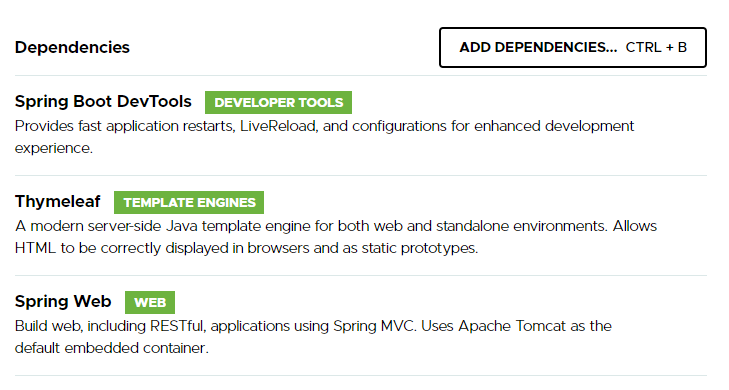

<div align="right">ENG | <a href="https://anastasiomarco.github.io/UploadReadExcelFile/">ITA</a></div>

# Upload e lettura di un file Excel

[readme 2](README_eng.md)

**Progetto di esempio su come caricare un file Excel e leggerlo, restituendone i dati letti.**

* Spring Boot
* Maven
* Apache POI
* JQuery

Andando su [Spring Inizializr](https://start.spring.io/) possiamo impostare il progetto in questo modo:




Una volta finito il download del progetto base basterà estrarlo e aprirlo con un IDE come IntelliJ IDEA.

Per integrare Apache POI bisognerà aggiungere le dipendenze associate nel file *pom.xml* generato, in questo modo:
```xml
<dependency>
  <groupId>org.apache.poi</groupId>
  <artifactId>poi</artifactId>
  <version>4.1.2</version>
</dependency>
<dependency>
  <groupId>org.apache.poi</groupId>
  <artifactId>poi-ooxml</artifactId>
  <version>4.1.2</version>
</dependency>
```
Nel path ***/resources/templates*** creiamo una pagina HTML (es. *upload.html*) contenente il pulsante per l'upload del file in formato Excel e la lettura dei dati:
```html
<!DOCTYPE html>
<html lang="en">
<head>
  <meta charset="UTF-8">
  <title>Upload</title>
</head>
<body>
<script src="https://ajax.googleapis.com/ajax/libs/jquery/3.6.0/jquery.min.js"></script>

<div class="custom-file">
  <form id="upload-form" enctype="multipart/form-data">
    <input class="custom-file-input" id="file" name="file" type="file"
      accept="application/vnd.ms-excel,
      application/vnd.openxmlformats-officedocument.spreadsheetml.sheet"
    onchange="onUpload();">
  </form>
</div>

<span id="showData"></span>

</body>
</html>
```
Andiamo adesso a gestire l'upload del file tramite uno script Javascript:
```javascript
function onUpload() {
	
  event.preventDefault();
  "use strict";

  var fileInput = document.getElementById('file');
  var file = fileInput.files[0];
  var formData = new FormData();
  formData.append('file',file);
        
  $.ajax({
    type: "post",
    url: '/onUpload',
    enctype: 'multipart/form-data',
    contentType: false,
    data: formData,
    processData: false,
    cache: false,
    timeout: 600000,
    success: function(data) {
      document.getElementById("showData").innerHTML = data; 
    },
    error: function() {
      console.log("error");
    }
  });
}
```
In questo modo avremo una semplice pagina con un pulsante e la possibilità di caricare un file. Andiamo ora a creare una classe Java contenente il controller per gestire il file caricato.

```java
@Controller
public class UploadController {

  @GetMapping("/")
  public String redirect(){
    return "redirect:/upload";
  }

  @GetMapping("/upload")
    public String upload(){
  return "upload";
  }

  @RequestMapping(value = "/onUpload", method = RequestMethod.POST)
  @ResponseBody
  public String singleFileUpload(@RequestParam(value = "file") MultipartFile file) {

    StringBuilder sb = new StringBuilder();
    
    try {
      InputStream fileInputStream = new BufferedInputStream(file.getInputStream());
      DataFormatter dataFormatter = new DataFormatter();
      XSSFWorkbook workbook = new XSSFWorkbook(fileInputStream);
      int numberOfSheets = workbook.getNumberOfSheets();
      for (int n = 0; n < numberOfSheets;n++){    //per ogni sheet
          XSSFSheet sheetAt = workbook.getSheetAt(n);
          int numberOfColumns = sheetAt.getRow(0).getLastCellNum();
          int numberOfRows = sheetAt.getLastRowNum();
          for (int r = 0; r <= numberOfRows; r++){  //per ogni riga
              for (int c = 0; c < numberOfColumns; c++) { //per ogni colonna
                  XSSFCell cell = sheetAt.getRow(r).getCell(c);
                  sb.append(dataFormatter.formatCellValue(cell));
                  sb.append("; ");
              }
              sb.append("<br>");
          }
      }
    } catch (IOException e) {
      e.printStackTrace();
    }
    return "Dati caricati:" + "<br>" + sb;
  }
}
```
La struttura del progetto avrà un aspetto simile a questo:


Creiamo un file Excel di esempio in modo tale da poter testare il programma:


Facciamo partire il progetto e, una volta completata l'inizializzazione andiamo all'indirizzo http://localhost:8080/upload
che ci mostrerà il pulsante di caricamento del file:


Scegliamo il file creato e i dati in esso presenti saranno visualizzati nella pagina HTML:


